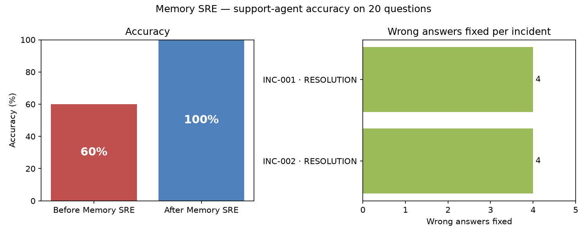
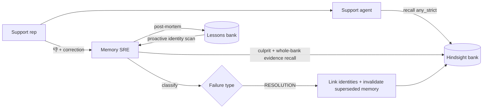

# Memory SRE

**Memory SRE — find the memory that made your agent wrong, and fix it. Built on Hindsight.**



On the 20-question support evaluation, the agent's accuracy went from **60% to 100%**. Two incidents, both classified RESOLUTION, fixed all 8 wrong answers: Kestrel Logistics ≡ Anvaya Technologies Pvt Ltd, and Saffron Retail ≡ Mehta Brothers Trading LLP. Source: [`data/results/eval_latest.json`](data/results/eval_latest.json).

## The problem

AI agents with long-term memory fail in new ways. The model can be fine and the prompt can be fine, and the agent is still confidently wrong, because of what it remembered or failed to remember.

When an answer is wrong, nobody can tell whether the model or the memory caused it. A support rep only sees a bad answer. An engineer sees a prompt, a model and thousands of stored facts.

Hindsight shows *what* was recalled for an answer. It does not tell you *whether that recall caused the failure*, which memory is to blame, or how to repair it safely.

## What Memory SRE does

**Diagnose → evidence → classify → repair (reversible) → verify → learn.**

1. **Diagnose.** When a rep marks an answer 👎 and pastes what the customer said, Memory SRE finds the **culprit memory**: the recalled fact the wrong claim follows from.
2. **Evidence.** It searches the **whole** memory bank, not just the customer's scope, for memories that support the correction, even when they name the customer differently.
3. **Classify.** It decides which of six failure types happened. For an identity split, it first confirms that the two records are the same customer from concrete linking evidence, such as a shared company email domain.
4. **Repair.** It fixes memory through Hindsight's own curation API, and every applied fix is **reversible** with one click (**Undo fix**).
5. **Verify.** It re-asks the original question and shows the before and after answers side by side.
6. **Learn.** Every fix is written as a post-mortem to a lessons bank. The **proactive scan** applies those lessons to find the next identity split before it causes a wrong answer.

## Failure taxonomy

| Type | What happened | Automatic fix |
|---|---|---|
| **RESOLUTION** | The correct fact is stored under a different name for the same customer (an identity split), so scoped recall never sees it. | Link the two identities, retain an identity-link memory tagged for both, and invalidate the superseded memory if it states a current state. |
| **FRESHNESS** | A newer fact superseded the memory the agent used, but only the outdated one was recalled. | Invalidate the outdated memory. |
| **RECALL_MISS** | The correct fact exists under this customer but was not retrieved for this question. | Retain a pinned restatement of the fact for the customer. |
| **EXECUTION** | The correct memory was retrieved and the agent still answered wrong: a model or prompt problem. | None. It is reported, because memory is not at fault. |
| **MISSING_KNOWLEDGE** | Memory never contained the correct fact. | Retain the verified correction, and invalidate the culprit if it states a current state. |
| **UNKNOWN** | No memory-level cause could be confirmed. | None. |

## Architecture



Code layout: the `memsre/` package holds all the logic (`agent.py`, `diagnose.py`, `repair.py`, `lessons.py`, plus the `hs.py` and `llm.py` clients). `app.py` is the Streamlit UI, and `scripts/` has `smoke.py`, `seed.py` and `eval.py`. The UI calls only the functions documented in [`API.md`](API.md).

## How Hindsight memory is used

- **retain** with timestamps, `document_id`, metadata and per-source `customer:*` tags. Every seed event is retained with its own event date, its source system and the customer key *as that source system knows the customer*. That last part is how the identity split arises. See `scripts/seed.py` and `memsre/hs.py`.
- **recall** scoped with `tags_match="any_strict"` for the support agent, so it sees only memories tagged for the customer (and linked identities), and **whole-bank recall** with no tag filter for the evidence search. See `memsre/agent.py` and `memsre/diagnose.py`.
- **Curation API:** memories are invalidated and restored reversibly (`PATCH …/memories/{id}` with `state`), after which Hindsight re-computes derived observations. See `memsre/repair.py`.
- **Documents API** removes repair artifacts on undo, such as identity-link, pin and correction documents. It is also used to empty a bank in place on reset. See `memsre/repair.py` and `memsre/hs.py`.
- **Operations API** is used to wait for consolidation after writes (`wait_for_idle`).
- **Tags API** enumerates every `customer:*` identity in the bank for the proactive scan.
- **A second bank of lessons:** every incident post-mortem is retained, and Hindsight's consolidation turns them into observations with proof counts, which drive the proactive scan. See `memsre/lessons.py`.

## Quickstart

Windows PowerShell:

```powershell
python -m venv venv
Set-ExecutionPolicy -Scope Process -ExecutionPolicy Bypass   # lets this shell run venv\Scripts\Activate.ps1
venv\Scripts\activate
python -m pip install -r requirements.txt
copy .env.example .env          # then fill in HINDSIGHT_API_KEY and GROQ_API_KEY (or GROQ_API_KEYS)
python scripts/smoke.py         # -> SMOKE OK
python scripts/seed.py          # fresh demo bank -> SEEDED 26 events (waits for Hindsight recall to settle)
streamlit run app.py
python scripts/eval.py          # optional: reseeds AND repairs the bank to rebuild the chart and eval_latest.json
                                # (an estimated ~80k Groq tokens); run seed.py again before a demo
pytest
```

## Demo walkthrough

1. In **Support Console**, select **Kestrel Logistics**:
   1. Ask *"What is Kestrel Logistics' API rate limit?"*. The agent answers 10000, which is wrong. Don't report it.
   2. Ask *"Can Kestrel Logistics export audit logs?"*. It answers "Yes…", which is also wrong.
   3. Click 👎, paste *"Wrong — the customer says audit log export fails. They told us they moved to the Growth plan in August."*, then click **Report & diagnose**.
2. In the **Incidents** tab you see:
   - the culprit memory (the June Enterprise signing);
   - the contradicting evidence, filed under `customer:anvaya`;
   - the identity link, via `ravi.k@anvaya.in` and `accounts@anvaya.in`;
   - root cause **RESOLUTION**, and a blast radius of 2.

   Then click **Apply fix** → **Re-ask question**. The answer changes from Yes to **No**, because Kestrel is now on the Growth plan, which doesn't include audit log export.
3. In **Memory Health**, check the lessons learned, then click **Run proactive scan**. It proposes **Saffron Retail ≡ Mehta Brothers Trading LLP**. Click **Link identities**, and the incident is recorded as "Prevented".
4. Finish on the before/after chart.

## Limitations

- The demo data is a fictional company.
- The defects are realistic but planted.
- Diagnosis needs a correction from a human.
- Identity linking relies on concrete evidence such as email domains.
- EXECUTION failures are reported, not auto-fixed.

## Implementation notes

These are honest deviations from the original build plan, each made to get the planned behaviour working reliably. The trial counts below were measured with throwaway probe scripts during development, all on `openai/gpt-oss-120b`. The probe scripts are not part of this repo.

- **Culprit prompt.** The culprit prompt starts with the same product catalog the agent saw. The agent's wrong "Yes" came from a memory *plus* the catalog ("signed Enterprise" and "Enterprise includes audit log export"). Without the catalog, the model found no culprit for the demo incident in 3 of 3 trials, so nothing was invalidated and the fix left the answer at "Yes". With it, the culprit was found in 3 of 3. See `memsre/diagnose.py`.
- **Evidence prompt.** Candidate lines for another customer's record get a computed hint when that customer's contacts share an email domain with this customer's, e.g. `[linked to Kestrel Logistics: shares email domain anvaya.in …]`. With the plan's verbatim prompt, the model never selected the Anvaya billing records as evidence: 0 of 14 trials at low, medium and high reasoning effort. Three rewordings of the prompt did no better (0 of 14). With the hint, the foreign billing records were selected in 6 of 6 trials (Kestrel and Saffron). See `memsre/diagnose.py`.
- **Identity prompt.** One sentence was added: *"A company email domain that appears in both records (not a free-mail provider such as gmail.com) is sufficient linking evidence on its own."* Without it, the Kestrel ≡ Anvaya pair was confirmed in only 1 of 3 calls at low reasoning effort, and 5 of 7 at high. With it, at the default low effort, all 8 calls on the two real pairs confirmed the link (confidence 0.95), and the 2 pairs with no shared domain were correctly rejected.
- **In-place bank reset, and waiting for recall to settle.** `reset_bank` empties the bank (its documents, then any remaining memories) and never deletes it. After a same-id delete and recreate, some Hindsight Cloud servers kept answering recall from the *deleted* bank for about 20 minutes. Even without deleting, recall can lag behind writes. For several minutes after a reseed, and for a minute or two after a repair, some servers returned deleted memories, invalidated memories or nothing at all. So `seed.py` waits, up to 30 minutes, until every customer's tag-scoped recall returns only valid memories of the new bank. `apply_fix`, `undo_fix` and `accept_proposal` wait, best-effort and up to 90 s, until the affected customer's recall is consistent. This makes an immediate **Re-ask** much more reliable. See `memsre/hs.py`, `memsre/repair.py` and `scripts/seed.py`.
- **Groq key rotation.** `GROQ_API_KEYS` accepts several keys, used round-robin. A key that hits a 429 cools down and the retry goes to another key instead of sleeping. The free tier allows 200k tokens per day per Groq organization, and one full `eval.py` run uses an estimated 80k. See `memsre/llm.py`.
- **Lesson detection.** `has_resolution_lesson()` also checks the lesson's `type:resolution` tag, because Hindsight's extraction paraphrases the post-mortem and drops the word "RESOLUTION".

## What's next

- Continuous monitoring with a memory health score.
- More failure types, such as WRITE extraction errors and cross-scope leaks.
- Microsoft Agent Framework integration and Teams alerts.
- A Hindsight webhook trigger on consolidation.

## Credits

Built on [Hindsight](https://github.com/vectorize-io/hindsight) by Vectorize, with LLM calls served by [Groq](https://groq.com). All companies and people in the demo data are fictional.
