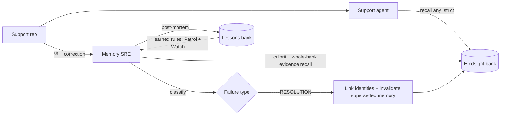
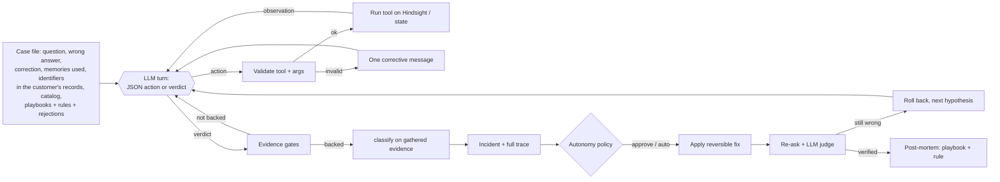
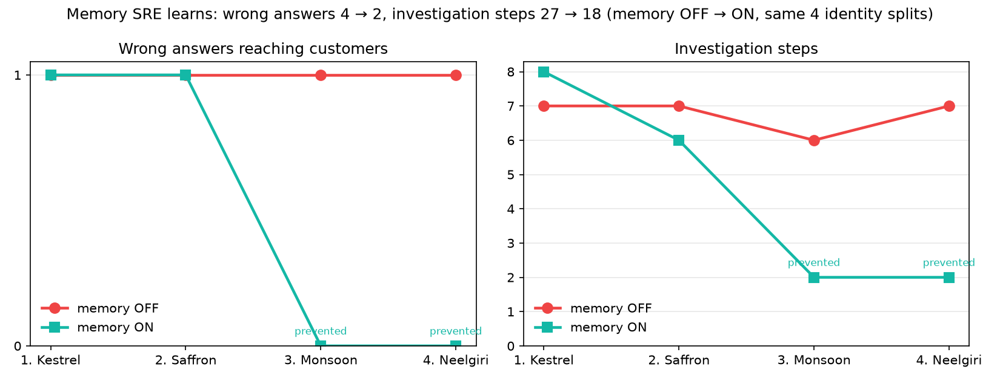

# Memory SRE

**Memory SRE — find the memory that made your agent wrong, and fix it. Built on Hindsight.**


On the 20-question support evaluation, the agent's accuracy went from **60% to 100%**. Two incidents, both classified RESOLUTION, fixed all 8 wrong answers: Kestrel Logistics ≡ Anvaya Technologies Pvt Ltd, and Saffron Retail ≡ Mehta Brothers Trading LLP. Source: [`data/results/eval_latest.json`](data/results/eval_latest.json).

It is an **agent that learns**. An investigator decides its own steps, fixes memory reversibly, verifies the fix, and writes what it learned back into Hindsight. In an A/B benchmark (same four identity splits, memory OFF vs ON), wrong answers reaching customers fell from **4 to 2**, and investigation steps from **27 to 18** ([details](#does-it-actually-improve-ab-learning-benchmark)).

## The problem

AI agents with long-term memory fail in new ways. The model can be fine and the prompt can be fine, and the agent is still confidently wrong, because of what it remembered or failed to remember.

When an answer is wrong, nobody can tell whether the model or the memory caused it. A support rep only sees a bad answer. An engineer sees a prompt, a model and thousands of stored facts.

Hindsight shows *what* was recalled for an answer. It does not tell you *whether that recall caused the failure*, which memory is to blame, or how to repair it safely.

## What Memory SRE does

**Investigate → act (reversibly) → verify → self-correct → learn → prevent.**

1. **Investigate.** When a rep marks an answer 👎 and pastes what the customer said, the **investigator agent** decides its own steps with 10 tools. It finds the **culprit memory** (the recalled fact the wrong claim follows from), searches the whole bank, follows concrete signals such as a shared email domain, and confirms identities. The full trace is shown in the UI.
2. **Classify.** `classify()` decides which of six failure types happened, from the evidence the agent gathered. The agent cannot simply assert a type.
3. **Act.** It repairs memory through Hindsight's own curation API. Every applied fix is **reversible** (**Undo fix**), and an autonomy policy decides whether a human must approve it first.
4. **Verify and self-correct.** It re-asks every affected question and has an LLM judge check each answer against the correction. If the fix didn't work, it rolls it back and tries its next hypothesis.
5. **Learn.** Each verified incident becomes a **playbook** and a **self-written detection rule** in a Hindsight lessons bank. It also refreshes a living **Memory SRE Playbook** mental model.
6. **Prevent.** **Patrol** and **Watch** run the learned rules to catch the next identity split before any wrong answer, and a reviewer's **Reject** becomes a rule exception.

## Failure taxonomy

| Type | What happened | Automatic fix |
|---|---|---|
| **RESOLUTION** | The correct fact is stored under a different name for the same customer (an identity split), so scoped recall never sees it. | Link the two identities, retain an identity-link memory tagged for both, and invalidate the superseded memory if it states a current state. |
| **FRESHNESS** | A newer fact superseded the memory the agent used, but only the outdated one was recalled. | Invalidate the outdated memory. |
| **RECALL_MISS** | The correct fact exists under this customer but was not retrieved for this question. | Retain a pinned restatement of the fact for the customer. |
| **EXECUTION** | The correct memory was retrieved and the agent still answered wrong: a model or prompt problem. | None. It is reported, because memory is not at fault. |
| **MISSING_KNOWLEDGE** | Memory never contained the correct fact. | Retain the verified correction, and invalidate the culprit if it states a current state. |
| **UNKNOWN** | No memory-level cause could be confirmed. | None. |

## Architecture



Code layout: the `memsre/` package holds all the logic. The investigator is `investigator.py` and its tools are in `tools.py`; `diagnose.py` holds the fixed pipeline and `classify()`; `repair.py` does act, verify and rollback; `lessons.py` handles post-mortems, playbooks, rules and feedback; and `autonomy.py` runs Watch and Patrol. `hs.py` and `llm.py` are the clients. `app.py` is the Streamlit UI, and `scripts/` has `smoke.py`, `seed.py`, `eval.py` and `learning_benchmark.py`. The UI calls only the functions documented in [`API.md`](API.md).

## Agent architecture

Memory SRE is a **bounded, tool-using agent**, not a fixed pipeline. When a rep reports a wrong answer, the **investigator** (`memsre/investigator.py`) decides its own steps. It searches, cross-checks and verifies, and only then gives a verdict. The fixed pipeline remains as a fallback.



**The loop.** Each turn the LLM returns strict JSON, either `{"thought", "action": {"tool", "args"}}` or `{"final": {...}}`, through `llm_json`, not native tool calling. The case file lists the concrete identifiers in the customer's own records (email domains and addresses, phones, account ids), so the agent searches with real signals instead of guessing them, and every turn restates its **open leads** (records sharing a signal that it hasn't compared yet) and the **turns left**. There are at most 10 turns, and the full trace (thought, tool, args and result per step, LLM calls, duration, playbook and rules used) is stored on the incident and shown in the UI.

**Tools** (`memsre/tools.py`, thin wrappers with argument schemas):

| Tool | What it does |
|---|---|
| `recall_customer(customer, query)` | Search one customer's memories and linked identities (`any_strict`) |
| `recall_whole_bank(query)` | Search every customer's memories, separating this customer's from other records |
| `get_memory(id)` | Fetch one memory in full |
| `list_customer_tags()` | List every `customer:*` record and its links |
| `find_records_sharing(signal_type, value)` | Find which records share a concrete signal: an email domain, email address, phone, account id or keyword |
| `compare_records(tag_a, tag_b)` | Identity check: are two records the same real-world customer? |
| `recall_lessons(query)` / `get_playbook()` | Read what past incidents taught, including the living playbook |
| `blast_radius(memory_ids)` | Count how many logged answers used these memories |
| `propose_fix(type, actions)` | Record the intended fix and preview the automatic repair |

**Guardrails.**
- Every action is validated against the registry. An invalid reply gets one corrective message, and **2 consecutive protocol failures** or the turn budget fall back to the fixed pipeline (`incident["fallback"] = True`).
- **Verdicts must be evidence-backed.** RESOLUTION, FRESHNESS, RECALL_MISS and EXECUTION need supporting memories. RESOLUTION also needs a `compare_records` check. MISSING_KNOWLEDGE or UNKNOWN needs a whole-bank search, and the agent must first rule out the other-customer records it saw. A premature verdict is pushed back and the agent keeps investigating.
- The agent can only cite memories it was shown, and `failure_type` is always recomputed by `classify()` from the evidence it gathered.

**Act, verify, self-correct** (`memsre/repair.py`).
1. `apply_fix` applies a reversible repair: it links identities, retains an identity-link memory, and invalidates the superseded memory.
2. It **re-asks** the incident question plus every logged question whose answer used the culprit memory.
3. An LLM judge checks each new answer against the correction.
4. If any is still wrong, the fix is **rolled back automatically**, the failed hypothesis is recorded, and the investigator tries its next hypothesis, at most 2 attempts. If none verifies, the incident is handed to a human with nothing left applied.

**Bounded autonomy.** An autonomy policy (`data/state/policy.json`) auto-applies a fix only when its kind is set to auto, the agent's confidence is at least 0.85, and the fix is reversible. The demo default is **approval for reactive incidents** and **auto-apply for prevented ones**. Every write, rollback, verification and policy decision is appended to an audit log (`data/state/audit.jsonl`).

**Watch and Patrol** (`memsre/autonomy.py`).
- **Watch** runs after every live answer. It runs the learned detection rules as cheap checks on what was just recalled, and calls the LLM only if a rule fires.
- **Patrol** runs every learned rule across the whole bank.

In both, the investigator verifies each hit in patrol mode (with `compare_records` required), and the policy acts on it.

## How it learns

Everything Memory SRE learns is stored **in Hindsight**, in a second bank of lessons, and it changes what the agent does next:

- **Playbooks (procedural memory).** After every verified incident, a post-mortem retains the symptom signature, the proven tool path, the root cause, the fix and the verified outcome. The investigator recalls similar playbooks at the start of each case and is told to follow a matching path first.
- **Self-written detection rules.** The same post-mortem has the LLM write a **general** rule: which signal to check (for example `email_domain`), how to check it, and what counts as confirmation. It's retained with tags `sre:rule`, `rule:<signal>`. Patrol and Watch derive their checks **only** from these rules. With an empty lessons bank they run **zero** checks; there is no hard-coded detection strategy.
- **Feedback memory.** **Reject** on a proposal, or **Reject pattern** on a patrol hit the agent dismissed, retains a rule exception, for example *"nimbusit.in is a managed-IT vendor shared by two companies, not linking evidence"*. Patrol and the investigator consult these exceptions, so a rejected pattern is not checked or proposed again.
- **A living playbook.** A Hindsight **mental model**, "Memory SRE Playbook", summarises how failures are detected, diagnosed and fixed. It's refreshed after each post-mortem, loaded by the investigator (`get_playbook`), and shown in the UI with its version history. Lessons also consolidate into Hindsight observations with **proof counts**.

### Does it actually improve? A/B learning benchmark

`python scripts/learning_benchmark.py` runs the same scenario twice. Each arm runs in its own process, with its own Hindsight banks, an empty lessons bank and its own local state. The scenario is the four planted identity splits, in a fixed order (Kestrel, Saffron, Monsoon, Neelgiri). In each episode a customer asks a question that touches the split; if the answer is wrong, the harness reports it, and the agent investigates, fixes and verifies.



| Episode | Memory OFF: wrong / steps / LLM calls | Memory ON: wrong / steps / LLM calls | Memory ON: handled by |
|---|---|---|---|
| 1. Kestrel | 1 / 7 / 11 | 1 / 8 / 12 | reactive: verified, but a shallow MISSING_KNOWLEDGE fix |
| 2. Saffron | 1 / 7 / 11 | 1 / 6 / 11 | reactive RESOLUTION; the post-mortem wrote an `email_domain` rule and the patrol ran |
| 3. Monsoon | 1 / 6 / 10 | **0 / 2 / 4** | **prevented** by the patrol |
| 4. Neelgiri | 1 / 7 / 11 | **0 / 2 / 4** | **prevented** by the patrol |
| **Total** | **4 wrong / 27 steps / 43 calls** / 827 s | **2 wrong / 18 steps / 34 calls** / 958 s | 2 prevented, 0 false links in either arm |

Source: [`data/results/learning_benchmark.json`](data/results/learning_benchmark.json). A prevented episode's LLM calls include the patrol's agent check of that pair. The totals count every call in the arm.

What happened:

- **Memory OFF.** The agent diagnosed all four splits correctly (RESOLUTION, each fix verified). Every split still reached a customer first, and each needed about 7 investigation steps and 11 LLM calls.
- **Memory ON, episode 1.** The first investigation settled for a verified but **shallow** fix. It diagnosed MISSING_KNOWLEDGE and retained the correction instead of linking the identities. So the post-mortem found no generalisable signal, and the first patrol had no rule to run.
- **Memory ON, episode 2.** Saffron was diagnosed as an identity split. Its post-mortem wrote an `email_domain` detection rule, and the patrol that followed ran 12 rule checks, found 3 candidates and prevented all 3. That included retroactively linking Kestrel ≡ Anvaya properly, fixing the root cause the shallow first fix had missed.
- **Memory ON, episodes 3–4.** Monsoon and Neelgiri were answered correctly: no wrong answer, 2 agent steps each.
- **Wall time is higher with memory** (958 s vs 827 s), because post-mortems, patrols and playbook refreshes cost time. What memory buys is fewer wrong answers and much cheaper handling of later cases.
- **This run predates two investigator fixes.** The shallow episode-1 verdict came from a guardrail loophole, fixed right after this run (commit `e966d65`): a lead surfaced by `find_records_sharing` was not required to be followed up. Later, the case file gained the customer's own identifiers (see [Implementation notes](#implementation-notes)). These numbers were measured before both. Re-run with `python scripts/learning_benchmark.py` (about 30 minutes, about 80 LLM calls).

## How Hindsight memory is used

- **retain** with timestamps, `document_id`, metadata and per-source `customer:*` tags. Every seed event is retained with its own event date, its source system and the customer key *as that source system knows the customer*. That last part is how the identity split arises. See `scripts/seed.py` and `memsre/hs.py`.
- **recall** scoped with `tags_match="any_strict"` for the support agent, so it sees only memories tagged for the customer (and linked identities), and **whole-bank recall** with no tag filter for the evidence search. See `memsre/agent.py` and `memsre/diagnose.py`.
- **Curation API:** memories are invalidated and restored reversibly (`PATCH …/memories/{id}` with `state`), after which Hindsight re-computes derived observations. See `memsre/repair.py`.
- **Documents API** removes repair artifacts on undo, such as identity-link, pin and correction documents. It is also used to empty a bank in place on reset. See `memsre/repair.py` and `memsre/hs.py`.
- **Operations API** is used to wait for consolidation after writes (`wait_for_idle`).
- **Tags API** enumerates every `customer:*` identity in the bank for the patrol and the investigator's `list_customer_tags` tool.
- **A second bank of lessons** holds procedural and feedback memory. Post-mortems, **playbooks** (`sre:playbook`), self-written **detection rules** (`sre:rule`, `rule:<signal>`) and reviewer **rejections** (`sre:exception`, `value:*`, `pair:*`) are retained there.
  - The investigator **recalls** similar playbooks.
  - Rules and exceptions are read back through the **tag-filtered list endpoint**, because it is consistent right after a write.
  - Hindsight's consolidation turns lessons into **observations with proof counts**.
  - See `memsre/lessons.py`.
- **Mental models API:** the living **Memory SRE Playbook** is a mental model in the lessons bank. It uses `refresh_after_consolidation`, is refreshed after each post-mortem, and its history is shown in the UI.
- **Memories list with `q`** is a text search, and it backs the generic `find_records_sharing` tool, the investigator's search for records that share a concrete signal.

## Quickstart

Windows PowerShell:

```powershell
python -m venv venv
Set-ExecutionPolicy -Scope Process -ExecutionPolicy Bypass   # lets this shell run venv\Scripts\Activate.ps1
venv\Scripts\activate
python -m pip install -r requirements.txt
copy .env.example .env          # then fill in HINDSIGHT_API_KEY and GROQ_API_KEY (or GROQ_API_KEYS)
python scripts/smoke.py         # -> SMOKE OK
python scripts/seed.py          # fresh demo bank -> SEEDED 36 events (waits for Hindsight recall to settle)
streamlit run app.py
python scripts/eval.py          # optional: reseeds AND repairs the bank to rebuild the chart and eval_latest.json
                                # (an estimated ~80k Groq tokens); run seed.py again before a demo
python scripts/learning_benchmark.py   # optional: A/B learning benchmark, memory OFF vs ON (~30 min, ~80 LLM calls)
pytest
```

## Demo walkthrough

1. In **Support Console**, select **Kestrel Logistics**:
   1. Ask *"What is Kestrel Logistics' API rate limit?"*. The agent answers 10000, which is wrong. Don't report it.
   2. Ask *"Can Kestrel Logistics export audit logs?"*. It answers "Yes…", which is also wrong.
   3. Click 👎, paste *"Wrong — the customer says audit log export fails. They told us they moved to the Growth plan in August."*, then click **Report & diagnose**.
2. In the **Incidents** tab, open the **Investigation trace** to watch the agent work. In our walkthrough run it took 8 steps and 9 LLM calls, about 85 s:
   - it searched the whole bank and found Anvaya's Growth-plan invoice, filed under `customer:anvaya`;
   - it searched for records sharing `anvaya.in`, an email domain from Kestrel's own records (its admin is `ravi.k@anvaya.in`);
   - it confirmed Kestrel ≡ Anvaya with `compare_records`, at confidence 0.95;
   - its premature verdicts appear as **verdict rejected** steps, where the evidence gates sent it back to gather evidence.

   The incident shows:
   - the culprit memory (the June Enterprise signing);
   - the supporting evidence (the Growth invoice);
   - the identity link, via `ravi.k@anvaya.in` and `accounts@anvaya.in`;
   - root cause **RESOLUTION**, and a blast radius of 2.

   The policy caption says the fix is waiting for approval, because reactive fixes need a human in the demo policy.
3. Click **Apply fix**. Memory SRE:
   - links the identities, retains an identity-link memory and invalidates the superseded Enterprise memory;
   - re-asks both affected questions and has a judge check each new answer (*2 of 2 re-asked answers consistent*).

   The answer changes from Yes to **No**, because Kestrel is now on the Growth plan, which doesn't include audit log export. **Undo fix** reverses all of it.
4. In **Memory Health**, the post-mortem's self-written **detection rule** (`email_domain`) and the living **Memory SRE Playbook** appear. Click **Run patrol**. In our run, 12 rule checks found 4 candidates, and the agent checked each one with `compare_records`:
   - It **prevented** three splits that no customer had hit yet: **Saffron Retail ≡ Mehta Brothers Trading LLP**, **Monsoon Trails ≡ Ruparel Holidays Pvt Ltd** and **Neelgiri Organics ≡ Kaveri Agro Foods LLP** (confidence 0.98–0.99). Each was auto-applied per the policy and can be undone.
   - It **dismissed** **Pinecrest Hospitals ≡ Vanadium Energy**, which share only `nimbusit.in`, the domain of their managed-IT vendor.
5. Expand **Reject this pattern for good (`nimbusit.in`)**, give a reason (for example *"Nimbus IT is a managed-IT vendor serving both companies"*), and click **Reject pattern**. The rejection is retained in Hindsight as a rule exception. Click **Run patrol** again: 12 checks, 0 candidates, so the vendor pattern is not checked again.
6. The **Learning curve** reads 2 → 0 → 0 → 0: the first identity split reached customers, and every later one was prevented before any wrong answer.
7. Finish on the before/after chart.

**Run proactive scan** is the read-only version of the patrol. It proposes links without writing anything, and each proposal has **Link identities**, **Accept all** and **Reject**.

## Limitations

- The demo data is a fictional company.
- The defects are realistic but planted. The seed data holds four identity splits: Kestrel and Saffron, plus Monsoon Trails and Neelgiri Organics, which were added after the committed evaluation run and are not covered by its 20 questions.
- Diagnosis needs a correction from a human.
- Identity linking relies on concrete evidence such as email domains.
- EXECUTION failures are reported, not auto-fixed.
- **Bounded autonomy by design.** The agent gets at most 10 turns per investigation, 5 in patrol mode, and 2 fix attempts. Fixes are auto-applied only above 0.85 confidence, only when the policy allows, and only when reversible. Every write is audited.
- The investigator is an LLM and is not deterministic. Guardrails, `classify()` and verification catch many mistakes; not all. A verified fix can still be shallow (see the benchmark).
- The investigator often proposes a verdict before it has the evidence. The evidence gates push it back, but each pushback costs a turn: 4 of the 8 in the walkthrough run.
- Watch runs after an answer, so it can prevent the next wrong answer, not un-send the one that fired it. The learning curve counts that answer.

## Implementation notes

These are honest deviations from the original build plan, each made to get the planned behaviour working reliably. The trial counts below were measured with throwaway probe scripts during development, all on `openai/gpt-oss-120b`. The probe scripts are not part of this repo.

- **Culprit prompt.** The culprit prompt starts with the same product catalog the agent saw. The agent's wrong "Yes" came from a memory *plus* the catalog ("signed Enterprise" and "Enterprise includes audit log export"). Without the catalog, the model found no culprit for the demo incident in 3 of 3 trials, so nothing was invalidated and the fix left the answer at "Yes". With it, the culprit was found in 3 of 3. See `memsre/diagnose.py`.
- **Evidence prompt.** Candidate lines for another customer's record get a computed hint when that customer's contacts share an email domain with this customer's, e.g. `[linked to Kestrel Logistics: shares email domain anvaya.in …]`. With the plan's verbatim prompt, the model never selected the Anvaya billing records as evidence: 0 of 14 trials at low, medium and high reasoning effort. Three rewordings of the prompt did no better (0 of 14). With the hint, the foreign billing records were selected in 6 of 6 trials (Kestrel and Saffron). See `memsre/diagnose.py`.
- **Identity prompt.** One sentence was added: *"A company email domain that appears in both records (not a free-mail provider such as gmail.com) is sufficient linking evidence on its own."* Without it, the Kestrel ≡ Anvaya pair was confirmed in only 1 of 3 calls at low reasoning effort, and 5 of 7 at high. With it, at the default low effort, all 8 calls on the two real pairs confirmed the link (confidence 0.95), and the 2 pairs with no shared domain were correctly rejected.
- **In-place bank reset, and waiting for recall to settle.** `reset_bank` empties the bank (its documents, then any remaining memories) and never deletes it. After a same-id delete and recreate, some Hindsight Cloud servers kept answering recall from the *deleted* bank for about 20 minutes. Even without deleting, recall can lag behind writes. For several minutes after a reseed, and for a minute or two after a repair, some servers returned deleted memories, invalidated memories or nothing at all. So `seed.py` waits, up to 30 minutes, until every customer's tag-scoped recall returns only valid memories of the new bank. `apply_fix`, `undo_fix` and `accept_proposal` wait, best-effort and up to 90 s, until the affected customer's recall is consistent. This makes an immediate **Re-ask** much more reliable. See `memsre/hs.py`, `memsre/repair.py` and `scripts/seed.py`.
- **Groq key rotation.** `GROQ_API_KEYS` accepts several keys, used round-robin. A key that hits a 429 cools down and the retry goes to another key instead of sleeping. The free tier allows 200k tokens per day per Groq organization, and one full `eval.py` run uses an estimated 80k. See `memsre/llm.py`.
- **Investigator method and evidence gates.** The agent's system prompt carries a general investigation method: culprit, then this customer, then the whole bank, then a shared-signal check, then an identity check. Verdicts must be evidence-backed, and a premature verdict is pushed back instead of counting as a protocol failure. In the first live run, before these were added, the agent saw Anvaya's Growth invoice and still concluded MISSING_KNOWLEDGE. See `memsre/investigator.py`.
- **Follow every lead.** Found by the learning benchmark and fixed after it: any record that `find_records_sharing` shows sharing a signal with the customer must be checked with `compare_records` before the agent may conclude the fact is missing.
- **Investigator perception.**
  - *The failure:* in a live walkthrough, the investigator spent all 10 turns guessing identifiers (`kestrel.com`, the keyword "Kestrel", an email address) and fell back to the fixed pipeline. Nothing in its case file showed that Kestrel's own admin is `ravi.k@anvaya.in`.
  - *The change:* the case file now lists the concrete identifiers found in the customer's own records: email domains and addresses, phones and account ids. They are extracted with the same regexes the tools use, with no LLM call. Every turn also restates the open leads and the turns left. The agent still decides what to search and whether to compare.
  - *The result:* in the next full walkthrough, the agent searched `anvaya.in`, confirmed the link with `compare_records` and concluded RESOLUTION in 8 steps (9 LLM calls), with no fallback. See `memsre/investigator.py`.
- **Phone matching.** `find_records_sharing` compares phones by their last 10 digits, so `+91 98450 12345` matches `98450-12345`. Before this, a phone search could never match: stored phones were reduced to digits, but the text search used the agent's formatting. See `memsre/tools.py`.
- **Lesson detection.** `has_resolution_lesson()` also checks the lesson's `type:resolution` tag, because Hindsight's extraction paraphrases the post-mortem and drops the word "RESOLUTION".

## What's next

- Continuous monitoring with a memory health score.
- More failure types, such as WRITE extraction errors and cross-scope leaks.
- Microsoft Agent Framework integration and Teams alerts.
- A Hindsight webhook trigger on consolidation.

## Credits

Built on [Hindsight](https://github.com/vectorize-io/hindsight) by Vectorize, with LLM calls served by [Groq](https://groq.com). All companies and people in the demo data are fictional.
